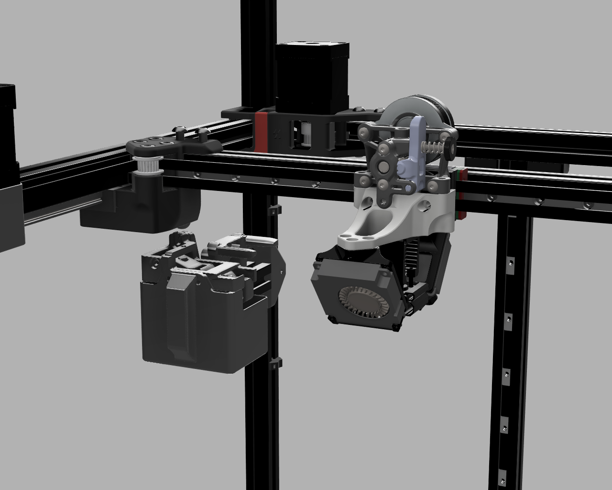
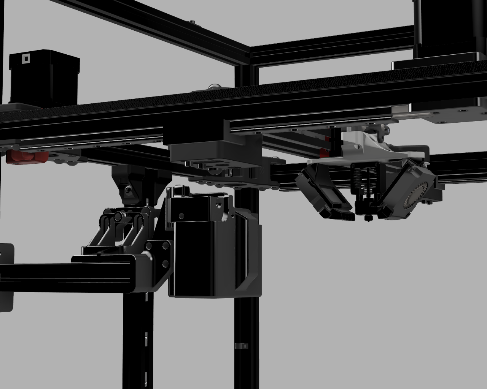

Extruder: https://github.com/Annex-Engineering/Sherpa_Mini-Extruder

Latest version of Annex Toolhead parts can be found here: https://github.com/Annex-Engineering/Gasherbrum-K3/tree/main/STLs/XY_Carriage

Dont know if later releases will still be compatible, therefore the ones I used are uploaded here.
If Parts are not in a folder or subfolder of a directory that includes an Annex-License, the GPL3 License applies. 

Sherpa Mini can mount at 3 points.

Hotend used: SliceEngineering Mosquito / Mellow Crazy

