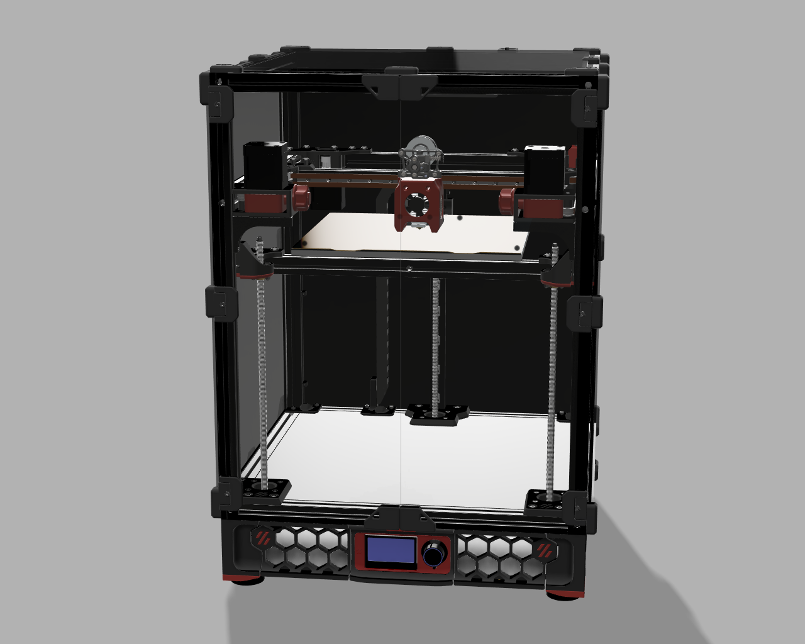

# Full MGN12 QuadAB Mod for the VORON Trident

This Mod allows you to use MGN12 for all linear rails and reduce the effective belt length by ~50% using two additional AB drives. This way it is possible to increase speed and precision. Using a different (leightweight) toolhead is highly recommended, not only to reduce the loss of buildspace but also to reduce the moving mass. 
This mod is currently NOT compatible with a Stock MGN9 Trident, since the belt-path is different and the mirrored XY Joints are build for the MGN12 Mount.
This mod does not support cable chains in X and Y in order to reduce moving mass.

Most Parts of the Trident remain unchanged. Only the Panel-Clips for the left and right Panels, Z-Carriage mounts, AB DriveMounts in the back and the XY-Joints need to be adjusted. The mounts for the AB-Drives in front replace the tensioners.

## BOM

## Pictures

# NOTE
Klipper currently (23.04.2022, master) does not support multiple AB Drives for CoreXY. Follow the [VZBot-Vz235 Manual](https://github.com/VzBoT3D/VzBoT-Vz235) to set up the machine. 

## Credits
[TypQxQ](https://github.com/TypQxQ/klipper/tree/Multiple_Steppers_on_CoreXY) for the Klipper adaptations
